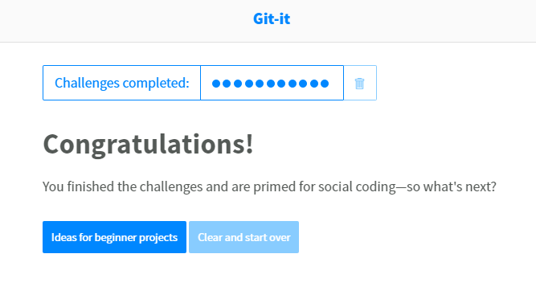

# Geeth Priya Kuppusamy

## Where are you from?

Am from "Pollachi, Coimbatore" which is a beautiful place in a southern state of India called 'Tamil Nadu'.

## IT Interest

I have a Mainframe work experience of 3 years from IBM. I discovered my fascination towards data science recently and decided to my Masters on it. I am very much intrigued by the knowledge that can be acquired by analysing myriad of data and how the knowledge affects various fields. Particularly interested: Machine Learning and Recommender Systems.

## Something Interesting About You

I love playing badminton to the point that I play all day till I drop. I am a little bit too proud of my baking skills and am personally responsible for turning several of my friends into sugar-fiends.

## Git-IT Tutorial Badge

